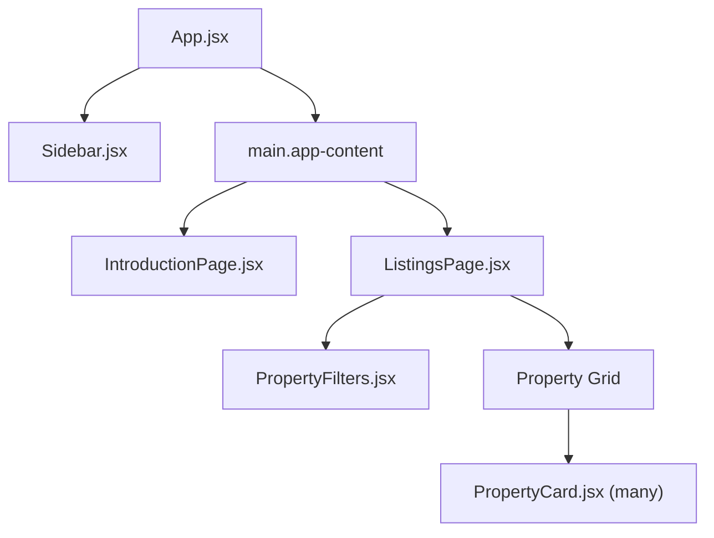
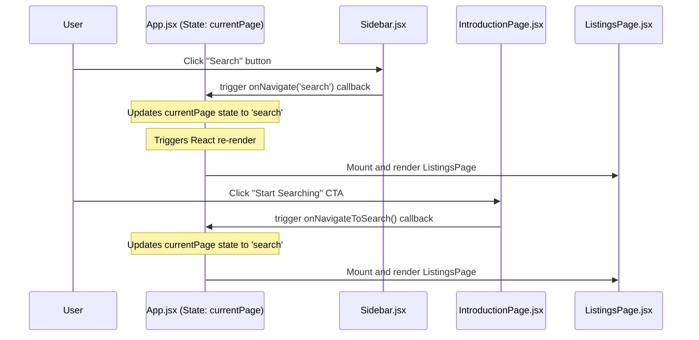
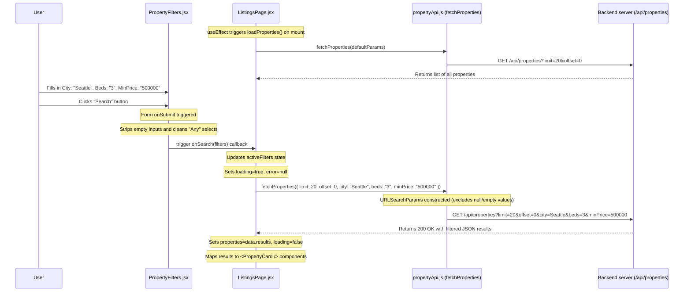

# Frontend Architecture and Data Flow Guide

This document provides a detailed breakdown of how the frontend components, state, and styles work together in the IDXExchange Property Listings application.

---

## 1. Component Hierarchy & Layout Structure

The layout is split into two major sections: the left sidebar (navigation) and the main content canvas.

### Component Tree
Here is how the React components are nested:



---

## 2. Desktop vs. Mobile Layout (The CSS Grid Fix)

Let's visualize how the sidebar and content are arranged and why the desktop layout was originally broken.

### Desktop View
The parent container `.app-layout` is a CSS Grid with two columns: `260px` and `1fr` (remaining space).

- **The Bug**:
  - The `.sidebar` is `position: fixed; width: 260px;`. Since it is `fixed`, it is taken **out of the normal layout flow**.
  - The browser's CSS Grid engine auto-places the next available *in-flow* element—which is `<main className="app-content">`—into the **first grid column** (260px wide).
  - `.app-content` had `margin-left: 260px;`. Pushing it left by 260px inside a 260px column left exactly `0px` of width to render the contents.

- **The Fix**:
  - We explicitly tell the browser to place `.app-content` into the **second grid column** by adding `grid-column: 2;`.
  - Since it is in column 2, it automatically starts at 260px, so we remove the `margin-left: 260px;` style.

Here is the visual layout on Desktop:

```mermaid
grid
┌──────────────────────────────────────┐
│ .app-layout                          │
│ ┌──────────────┬───────────────────┐ │
│ │ Column 1     │ Column 2          │ │
│ │ (260px)      │ (1fr)             │ │
│ ├──────────────┼───────────────────┤ │
│ │ [Sidebar]    │ [app-content]     │ │
│ │ (Fixed,      │                   │ │
│ │  Overlays    │ (grid-column: 2)  │ │
│ │  Column 1)   │                   │ │
│ └──────────────┴───────────────────┘ │
└──────────────────────────────────────┘
```

### Mobile View
On screen widths of `768px` or less:
- The `.sidebar` is changed to `position: relative` (making it in-flow).
- The grid is redefined to stack columns vertically: `grid-template-columns: 1fr;`.
- `.app-content` is placed at `grid-column: 1;`.
- The sidebar becomes a top header, and the content flows naturally below it.

---

## 3. Client-Side Page Navigation Flow

Because React Router is not introduced until later, page navigation is managed using local state in `App.jsx`.



---

## 4. Search and Filtering Flow (State & API Integration)

Here is a step-by-step trace of how filtering a property works:

### Interactive Sequence Diagram



---

## 5. Data Flow Details (From DB representation to UI components)

### Property Image & Field Mapping
The keys in the returned property object match the database columns mapped via alias in the SQL query:

| DB Column | Backend alias / Frontend key | Description |
|-----------|------------------------------|-------------|
| `L_ListingID` | `listingId` | Unique MLS listing identification string |
| `L_DisplayId` | `propertyId` | User-facing display ID string |
| `L_SystemPrice` | `listPrice` | Numeric listing price in USD |
| `L_Address` | `address` | Street address |
| `L_City` | `city` | City name |
| `L_State` | `state` | State code |
| `L_Zip` | `zipCode` | 5-digit ZIP code |
| `L_Keyword2` | `beds` | Number of bedrooms |
| `LM_Dec_3` | `baths` | Number of bathrooms |
| `LM_Int2_3` | `sqft` | Square footage |
| `L_Photos` | `photos` | JSON string array of image URLs |

### Rendering inside `<PropertyCard />`
The photos for a listing are stored in the database as a raw JSON string array in the `L_Photos` column (e.g. `["http://...", "http://..."]`).
The frontend formats and uses this as follows:

```
[Backend response JSON] 
  {
     "listingId": "10243",
     "propertyId": "MD10243",
     "address": "123 Main St",
     "city": "Portland",
     "state": "OR",
     "zipCode": "97201",
     "listPrice": 450000,
     "beds": 3,
     "baths": 2,
     "sqft": 1850,
     "photos": "[\"https://.../img1.jpg\", \"https://.../img2.jpg\"]"
  }
     ↓
Passed to <PropertyCard property={property} />
     ↓
Calls parsePhotos(property.photos) in utils/format.js
     ↓
Uses JSON.parse(str) inside try/catch block
     ↓
If valid JSON array: Returns ["https://.../img1.jpg", "https://.../img2.jpg"]
If invalid/empty: Returns []
     ↓
Card displays first item: photos[0] (or fallback placeholder image if empty)
```

### Formatting Utilities in `utils/format.js`
1. `formatPrice(price)`: Converts raw database numbers into formatted US currency.
   - Example: `425000` → `$425,000` (calls `.toLocaleString('en-US', { style: 'currency', currency: 'USD', maximumFractionDigits: 0 })`).
2. `parsePhotos(photosStr)`: Safely decodes JSON array strings representing photos, preventing rendering crashes on missing or malformed database fields.
