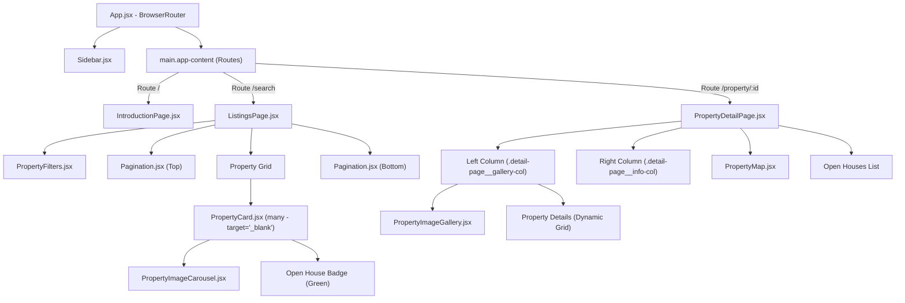
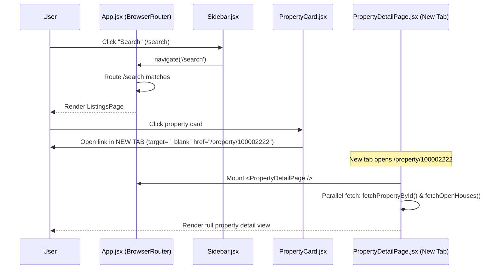
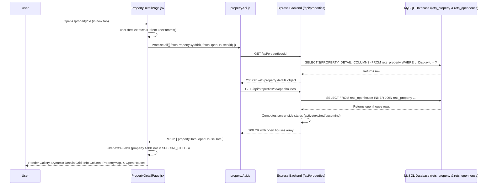

# Frontend Architecture and Data Flow Guide

This document provides a detailed breakdown of how the frontend components, routing, state, and styles work together in the IDXExchange Property Listings application.

---

## 1. Component Hierarchy & Layout Structure

The layout is a split-screen dashboard: the left sidebar (navigation) and the main content canvas driven by React Router.

### Component Tree
Here is how the React components are nested and routed:

```mermaid
graph TD
    App[App.jsx - BrowserRouter] --> Sidebar[Sidebar.jsx]
    App --> MainContent["main.app-content (Routes)"]
    MainContent -->|Route /| IntroPage[IntroductionPage.jsx]
    MainContent -->|Route /search| ListingsPage[ListingsPage.jsx]
    MainContent -->|Route /property/:id| DetailPage[PropertyDetailPage.jsx]
    
    ListingsPage --> PropertyFilters[PropertyFilters.jsx]
    ListingsPage --> PaginationTop["Pagination.jsx (Top)"]
    ListingsPage --> PropertyCardGrid["Property Grid"]
    ListingsPage --> PaginationBottom["Pagination.jsx (Bottom)"]
    
    PropertyCardGrid --> PropertyCard["PropertyCard.jsx (many - target='_blank')"]
    PropertyCard --> Carousel[PropertyImageCarousel.jsx]
    PropertyCard --> OpenHouseBadge["Open House Badge (Green)"]

    DetailPage --> GalleryCol["Left Column (.detail-page__gallery-col)"]
    DetailPage --> InfoCol["Right Column (.detail-page__info-col)"]
    DetailPage --> PropertyMap[PropertyMap.jsx]
    DetailPage --> OpenHousesSection["Open Houses List"]

    GalleryCol --> Gallery[PropertyImageGallery.jsx]
    GalleryCol --> PropertyDetails["Property Details (Dynamic Grid)"]
```

---

## 2. Desktop vs. Mobile Layout (The CSS Grid Layout)

### Desktop View
The parent container `.app-layout` is a CSS Grid with two columns: `260px` and `1fr` (remaining space).

- `.sidebar` is `position: fixed; width: 260px;`.
- `<main className="app-content">` is placed into the **second grid column** with `grid-column: 2;`.
- The content canvas spans the remaining width and scrolls vertically independently.

```mermaid
grid
┌──────────────────────────────────────┐
│ .app-layout                          │
│ ┌──────────────┬───────────────────┐ │
│ │ Column 1     │ Column 2          │ │
│ │ (260px)      │ (1fr)             │ │
│ ├──────────────┼───────────────────┤ │
│ │ [Sidebar]    │ [app-content]     │ │
│ │ (Fixed,      │                   │ │
│ │  Overlays    │ (grid-column: 2)  │ │
│ │  Column 1)   │                   │ │
│ └──────────────┴───────────────────┘ │
└──────────────────────────────────────┘
```

### Mobile View
On screen widths of `768px` or less:
- `.sidebar` becomes `position: relative` (in-flow horizontal header bar).
- Grid layout switches to `grid-template-columns: 1fr;`.
- `.app-content` occupies `grid-column: 1;`.

---

## 3. Client-Side Routing & Multi-Tab Detail Navigation

Page navigation is managed using `react-router-dom` (`BrowserRouter`, `Routes`, `Route`).

```mermaid
sequenceDiagram
    participant User
    participant App as App.jsx (BrowserRouter)
    participant Sidebar as Sidebar.jsx
    participant Card as PropertyCard.jsx
    participant DetailPage as PropertyDetailPage.jsx (New Tab)

    User->>Sidebar: Click "Search" (/search)
    Sidebar->>App: navigate('/search')
    App->>App: Route /search matches
    App-->>User: Render ListingsPage

    User->>Card: Click property card
    Card->>User: Open link in NEW TAB (target="_blank" href="/property/100002222")
    Note over DetailPage: New tab opens /property/100002222
    DetailPage->>App: Mount <PropertyDetailPage />
    DetailPage->>DetailPage: Parallel fetch: fetchPropertyById() & fetchOpenHouses()
    DetailPage-->>User: Render full property detail view
```

---

## 4. Property Detail Page Data Flow

Here is a step-by-step trace of how the Property Detail Page loads and renders data:

```mermaid
sequenceDiagram
    participant User
    participant DP as PropertyDetailPage.jsx
    participant API as propertyApi.js
    participant Backend as Express Backend (/api/properties)
    participant DB as MySQL Database (rets_property & rets_openhouse)

    User->>DP: Opens /property/:id (in new tab)
    DP->>DP: useEffect extracts ID from useParams()
    DP->>API: Promise.all([ fetchPropertyById(id), fetchOpenHouses(id) ])
    
    API->>Backend: GET /api/properties/:id
    Backend->>DB: SELECT ${PROPERTY_DETAIL_COLUMNS} FROM rets_property WHERE L_DisplayId = ?
    DB-->>Backend: Returns row
    Backend-->>API: 200 OK with property details object

    API->>Backend: GET /api/properties/:id/openhouses
    Backend->>DB: SELECT FROM rets_openhouse INNER JOIN rets_property ...
    DB-->>Backend: Returns open house rows
    Backend->>Backend: Computes server-side status (active/expired/upcoming)
    Backend-->>API: 200 OK with open houses array

    API-->>DP: Return [ propertyData, openHouseData ]
    DP->>DP: Filter extraFields (property fields not in SPECIAL_FIELDS)
    DP-->>User: Render Gallery, Dynamic Details Grid, Info Column, PropertyMap, & Open Houses
```

---

## 5. Data Flow Details & Mappings

### Listing & Property Field Mappings

The backend maps database columns into structured JSON objects:

| DB Column | API Alias | Component / Feature |
|-----------|-----------|--------------------|
| `L_ListingID` | `listingId` | Unique listing ID |
| `L_DisplayId` | `displayId` / `propertyId` | URL parameter & property lookup ID |
| `L_SystemPrice` | `listPrice` | Formatted via `formatPrice()` |
| `L_Address` | `address` | Card & Detail page header |
| `L_City` | `city` | Location line & filter |
| `L_State` | `state` | Location line & filter |
| `L_Zip` | `zipCode` | Location line & filter |
| `L_Keyword2` | `beds` | Stats bar |
| `LM_Dec_3` | `baths` | Stats bar |
| `LM_Int2_3` | `sqft` | Stats bar |
| `YearBuilt` | `yearBuilt` | Detail page stats bar |
| `L_Remarks` | `description` | Detail page description section |
| `L_Photos` | `photos` | Parsed via `parsePhotos()` into URL array |
| `LMD_MP_Latitude` | `latitude` | Used by `<PropertyMap />` |
| `LMD_MP_Longitude` | `longitude` | Used by `<PropertyMap />` |
| `L_Type_` | `propertyType` | Dynamic "Property Details" grid |
| `L_Status` | `status` | Dynamic "Property Details" grid |
| `[Other Cols]` | `[alias]` | Dynamic "Property Details" grid (via `PROPERTY_DETAIL_COLUMNS`) |

### Open House Event Object Structure

Returned by `GET /api/properties/:id/openhouses`:

| Property | Type | Description / UI Badge |
|----------|------|------------------------|
| `listingId` | String | Property display ID |
| `date` | String | Formatted via `formatDate()` |
| `startTime` | String | Formatted via `formatTime()` |
| `endTime` | String | Formatted via `formatTime()` |
| `status` | String | `"active"` (🟢 Green), `"expired"` (🔴 Red), `"upcoming"` (🔵 Blue) |
| `OpenHouseRemarks` | String | Agent remarks string |

---

## 6. Formatting Utilities (`utils/format.js`)

1. **`formatPrice(price)`**: Converts numbers to USD currency format (`459900` → `$459,900`).
2. **`parsePhotos(photosStr)`**: Safely parses `L_Photos` JSON strings into URL arrays.
3. **`formatTime(timeStr)`**: Formats database time strings (`"0 days 14:00:00"` → `"2:00 PM"`).
4. **`formatDate(dateStr)`**: Formats ISO date strings into readable dates (`"Sat, Jun 15, 2026"`).
