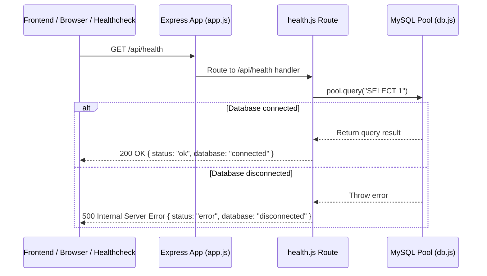
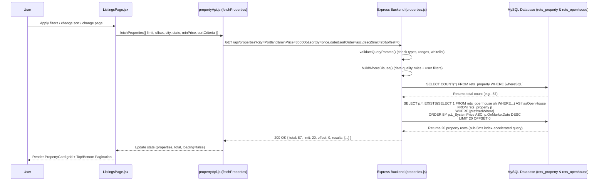
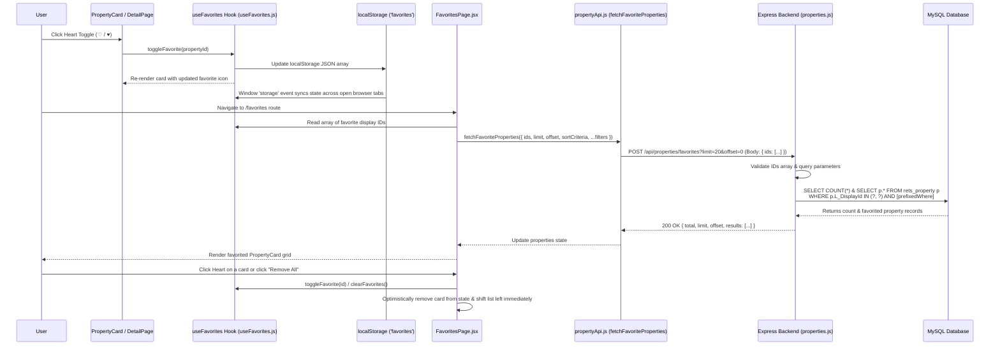
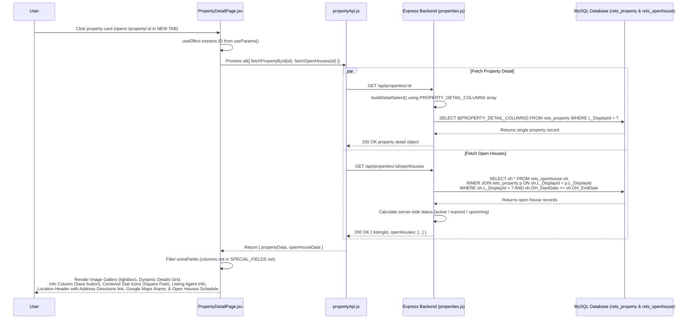
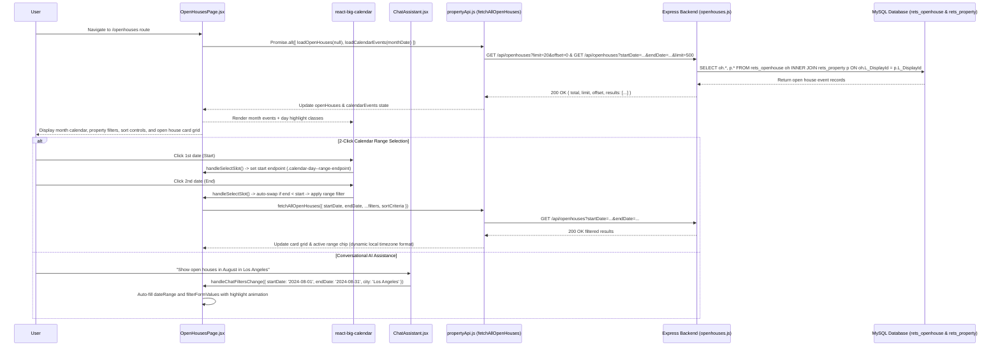

# Frontend Architecture and Data Flow Guide

This document provides a detailed breakdown of how the frontend components, routing, state, and styles work together in the IDXExchange Property Listings application.

---

## 1. Component Hierarchy & Layout Structure

The layout is a split-screen dashboard: the left sidebar (navigation) and the main content canvas driven by React Router.

### Component Tree
Here is how the React components are nested and routed:

```mermaid
graph TD
    App[App.jsx - BrowserRouter] --> Sidebar[Sidebar.jsx]
    App --> MainContent["main.app-content"]
    MainContent --> ErrorBoundary[ErrorBoundary.jsx]
    ErrorBoundary --> Routes[Routes]
    Routes -->|Route /| IntroPage[IntroductionPage.jsx]
    Routes -->|Route /search| ListingsPage[ListingsPage.jsx]
    Routes -->|Route /chat-search| ChatSearchPage[ChatSearchPage.jsx]
    Routes -->|Route /favorites| FavoritesPage[FavoritesPage.jsx]
    Routes -->|Route /openhouses| OpenHousesPage[OpenHousesPage.jsx]
    Routes -->|Route /property/:id| DetailPage[PropertyDetailPage.jsx]
    
    ChatSearchPage --> ChatAssistantOpen["ChatAssistant.jsx (open by default)"]
    ChatSearchPage --> DirectApiFetch["Direct API Execution on Chat Filter Update"]
    ChatSearchPage --> ChatGrid["Property Card Grid"]

    ListingsPage --> PropertyFilters[PropertyFilters.jsx]
    ListingsPage --> SortControls[SortControls.jsx]
    ListingsPage --> PaginationTop["Pagination.jsx (Top)"]
    ListingsPage --> PropertyCardGrid["Property Grid"]
    ListingsPage --> PaginationBottom["Pagination.jsx (Bottom)"]
    
    FavoritesPage --> RemoveAllBtn["Remove All Button (Header)"]
    FavoritesPage --> FavFilters[PropertyFilters.jsx]
    FavoritesPage --> FavSort[SortControls.jsx]
    FavoritesPage --> FavGrid["Property Grid (Instant Shift)"]
    
    PropertyCardGrid --> PropertyCard["PropertyCard.jsx (many - target='_blank')"]
    FavGrid --> PropertyCard
    PropertyCard --> Carousel[PropertyImageCarousel.jsx]
    PropertyCard --> OpenHouseBadge["Open House Badge (Green)"]
    PropertyCard --> StatusBadge["Status Badge (Active/Pending)"]
    PropertyCard --> HeartBtn["Favorite Heart Button (♡ / ♥)"]

    DetailPage --> GalleryCol["Left Column (.detail-page__gallery-col)"]
    DetailPage --> InfoCol["Right Column (.detail-page__info-col)"]
    DetailPage --> PropertyMap[PropertyMap.jsx]
    DetailPage --> OpenHousesSection["Open Houses List"]

    InfoCol --> SaveBtn["Save / Saved Favorite Button"]
    GalleryCol --> Gallery[PropertyImageGallery.jsx]
    GalleryCol --> PropertyDetails["Property Details (Dynamic Grid)"]
```

---

## 2. Desktop vs. Mobile Layout (The CSS Grid Layout)

### Desktop View
The parent container `.app-layout` is a CSS Grid with two columns: `260px` and `1fr` (remaining space).

- `.sidebar` is `position: fixed; width: 260px;`.
- `<main className="app-content">` is placed into the **second grid column** with `grid-column: 2;`.
- The content canvas spans the remaining width and scrolls vertically independently.

---

## 3. Client-Side Routing & Navigation Flow

Page navigation is managed using `react-router-dom` (`BrowserRouter`, `Routes`, `Route`).

Routes:
- `/` — **Introduction Landing Page**
- `/search` — **Property Search Page** (filters + multi-column sort + grid + pagination)
- `/favorites` — **Favorites View** (saved properties + Remove All + filters + sort + pagination + instant card removal)
- `/property/:id` — **Property Detail Page** (opens in a **new tab** on card click)

---

## 4. Comprehensive End-to-End Data Flows

### Flow A: Health Check Endpoint (`GET /api/health`)

```mermaid
sequenceDiagram
    participant Client as Frontend / Browser / Healthcheck
    participant Express as Express App (app.js)
    participant Route as health.js Route
    participant DB as MySQL Pool (db.js)

    Client->>Express: GET /api/health
    Express->>Route: Route to /api/health handler
    Route->>DB: pool.query("SELECT 1")
    alt Database connected
        DB-->>Route: Return query result
        Route-->>Client: 200 OK { status: "ok", database: "connected" }
    else Database disconnected
        DB-->>Route: Throw error
        Route-->>Client: 500 Internal Server Error { status: "error", database: "disconnected" }
    end
```

---

### Flow B: Property Search, Filtering, Multi-Column Sort & Pagination (`GET /api/properties`)

> **Note on In-Memory Caching**: `ListingsPage`, `FavoritesPage`, and `OpenHousesPage` utilize module-level caches (`listingsCache`, `favoritesCache`, `openHousesCache`). When navigating between routes via React Router, mounted pages initialize state from cache and skip API re-fetching unless search filters, sort controls, date ranges, or pagination are explicitly modified by the user.

```mermaid
sequenceDiagram
    participant User
    participant ListingsPage as ListingsPage.jsx
    participant API as propertyApi.js (fetchProperties)
    participant Express as Express Backend (properties.js)
    participant DB as MySQL Database (rets_property & rets_openhouse)

    User->>ListingsPage: Apply filters / change sort / change page
    ListingsPage->>API: fetchProperties({ limit, offset, city, state, minPrice, sortCriteria })
    API->>Express: GET /api/properties?city=Portland&minPrice=300000&sortBy=price,date&sortOrder=asc,desc&limit=20&offset=0
    
    Express->>Express: validateQueryParams() (check types, ranges, whitelist)
    Express->>Express: buildWhereClause() (data quality rules + user filters)
    
    Express->>DB: SELECT COUNT(*) FROM rets_property WHERE [whereSQL]
    DB-->>Express: Returns total count (e.g., 87)
    
    Express->>DB: SELECT p.*, EXISTS(SELECT 1 FROM rets_openhouse oh WHERE...) AS hasOpenHouse<br/>FROM rets_property p<br/>WHERE [prefixedWhere]<br/>ORDER BY p.L_SystemPrice ASC, p.OnMarketDate DESC<br/>LIMIT 20 OFFSET 0
    DB-->>Express: Returns 20 property rows (sub-5ms index-accelerated query)
    
    Express-->>API: 200 OK { total: 87, limit: 20, offset: 0, results: [...] }
    API-->>ListingsPage: Update state (properties, total, loading=false)
    ListingsPage-->>User: Render PropertyCard grid + Top/Bottom Pagination
```

---

### Flow C: Favorites Management & ID List Search (`POST /api/properties/favorites`)

```mermaid
sequenceDiagram
    participant User
    participant Card as PropertyCard / DetailPage
    participant Hook as useFavorites Hook (useFavorites.js)
    participant Storage as localStorage ('favorites')
    participant FavPage as FavoritesPage.jsx
    participant API as propertyApi.js (fetchFavoriteProperties)
    participant Express as Express Backend (properties.js)
    participant DB as MySQL Database

    User->>Card: Click Heart Toggle (♡ / ♥)
    Card->>Hook: toggleFavorite(propertyId)
    Hook->>Storage: Update localStorage JSON array
    Hook-->>Card: Re-render card with updated favorite icon
    Storage->>Hook: Window 'storage' event syncs state across open browser tabs

    User->>FavPage: Navigate to /favorites route
    FavPage->>Hook: Read array of favorite display IDs
    FavPage->>API: fetchFavoriteProperties({ ids, limit, offset, sortCriteria, ...filters })
    API->>Express: POST /api/properties/favorites?limit=20&offset=0 (Body: { ids: [...] })
    
    Express->>Express: Validate IDs array & query parameters
    Express->>DB: SELECT COUNT(*) & SELECT p.* FROM rets_property p<br/>WHERE p.L_DisplayId IN (?, ?) AND [prefixedWhere]
    DB-->>Express: Returns count & favorited property records
    Express-->>API: 200 OK { total, limit, offset, results: [...] }
    API-->>FavPage: Update properties state
    FavPage-->>User: Render favorited PropertyCard grid

    User->>FavPage: Click Heart on a card or click "Remove All"
    FavPage->>Hook: toggleFavorite(id) / clearFavorites()
    FavPage->>FavPage: Optimistically remove card from state & shift list left immediately
```

---

### Flow D: Property Detail Page & Parallel Open Houses Fetch (`GET /api/properties/:id` & `GET /api/properties/:id/openhouses`)

```mermaid
sequenceDiagram
    participant User
    participant DP as PropertyDetailPage.jsx
    participant API as propertyApi.js
    participant Express as Express Backend (properties.js)
    participant DB as MySQL Database (rets_property & rets_openhouse)

    User->>DP: Click property card (opens /property/:id in NEW TAB)
    DP->>DP: useEffect extracts ID from useParams()
    DP->>API: Promise.all([ fetchPropertyById(id), fetchOpenHouses(id) ])

    par Fetch Property Detail
        API->>Express: GET /api/properties/:id
        Express->>Express: buildDetailSelect() using PROPERTY_DETAIL_COLUMNS array
        Express->>DB: SELECT ${PROPERTY_DETAIL_COLUMNS} FROM rets_property WHERE L_DisplayId = ?
        DB-->>Express: Returns single property record
        Express-->>API: 200 OK property detail object
    and Fetch Open Houses
        API->>Express: GET /api/properties/:id/openhouses
        Express->>DB: SELECT oh.* FROM rets_openhouse oh<br/>INNER JOIN rets_property p ON oh.L_DisplayId = p.L_DisplayId<br/>WHERE oh.L_DisplayId = ? AND oh.OH_StartDate <= oh.OH_EndDate
        DB-->>Express: Returns open house records
        Express->>Express: Calculate server-side status (active / expired / upcoming)
        Express-->>API: 200 OK { listingId, openHouses: [...] }
    end

    API-->>DP: Return [ propertyData, openHouseData ]
    DP->>DP: Filter extraFields (columns not in SPECIAL_FIELDS set)
    DP-->>User: Render Image Gallery (lightbox), Dynamic Details Grid,<br/>Info Column (Save button), Centered Stat Icons (Square Feet), Listing Agent Info,<br/>Location Header with Address Directions link, Google Maps iframe, & Open Houses Schedule
```

---

### Flow E: Open Houses Calendar & Date Range Search (`GET /api/openhouses`)

```mermaid
sequenceDiagram
    participant User
    participant OHP as OpenHousesPage.jsx
    participant Cal as react-big-calendar
    participant Chat as ChatAssistant.jsx
    participant API as propertyApi.js (fetchAllOpenHouses)
    participant Express as Express Backend (openhouses.js)
    participant DB as MySQL Database (rets_openhouse & rets_property)

    User->>OHP: Navigate to /openhouses route
    OHP->>API: Promise.all([ loadOpenHouses(null), loadCalendarEvents(monthDate) ])
    API->>Express: GET /api/openhouses?limit=20&offset=0 & GET /api/openhouses?startDate=...&endDate=...&limit=500
    Express->>DB: SELECT oh.*, p.* FROM rets_openhouse oh INNER JOIN rets_property p ON oh.L_DisplayId = p.L_DisplayId
    DB-->>Express: Return open house event records
    Express-->>API: 200 OK { total, limit, offset, results: [...] }
    API-->>OHP: Update openHouses & calendarEvents state
    OHP-->>Cal: Render month events + day highlight classes
    OHP-->>User: Display month calendar, property filters, sort controls, and open house card grid

    alt 2-Click Calendar Range Selection
        User->>Cal: Click 1st date (Start)
        Cal->>OHP: handleSelectSlot() -> set start endpoint (.calendar-day--range-endpoint)
        User->>Cal: Click 2nd date (End)
        Cal->>OHP: handleSelectSlot() -> auto-swap if end < start -> apply range filter
        OHP->>API: fetchAllOpenHouses({ startDate, endDate, ...filters, sortCriteria })
        API->>Express: GET /api/openhouses?startDate=...&endDate=...
        Express-->>API: 200 OK filtered results
        API-->>OHP: Update card grid & active range chip (dynamic local timezone format)
    else Conversational AI Assistance
        User->>Chat: "Show open houses in August in Los Angeles"
        Chat->>OHP: handleChatFiltersChange({ startDate: '2024-08-01', endDate: '2024-08-31', city: 'Los Angeles' })
        OHP->>OHP: Auto-fill dateRange and filterFormValues with highlight animation
    end
```

---

## 5. Formatting Utilities (`utils/format.js`)

1. **`formatPrice(price)`**: Converts numbers to USD currency format (`459900` → `$459,900`).
2. **`parsePhotos(photosStr)`**: Safely parses `L_Photos` JSON strings into URL arrays.
3. **`formatTime(timeStr)`**: Formats database time strings (`"0 days 14:00:00"` → `"2:00 PM"`).
4. **`formatDate(dateStr, locale)`**: Parses `YYYY-MM-DD` date-only strings as local midnight (`new Date(year, month - 1, day)`) to dynamically format dates in the user's browser timezone without UTC offset shifts.

